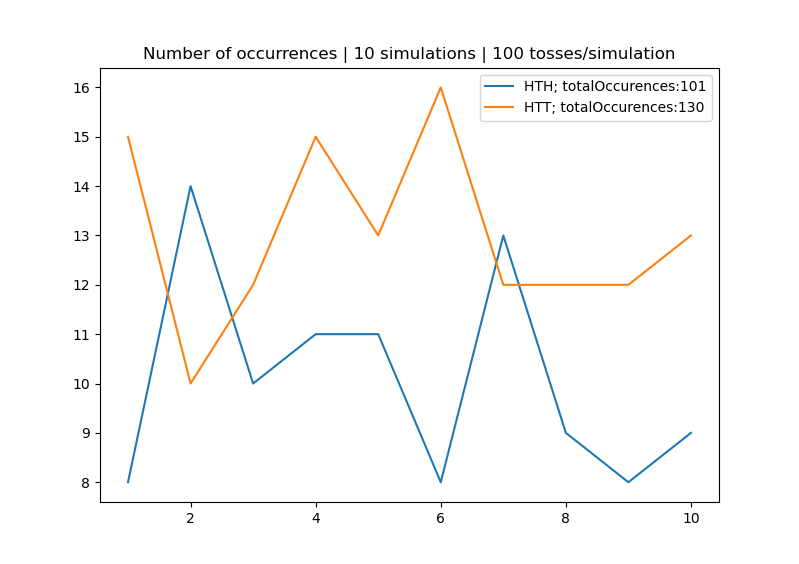
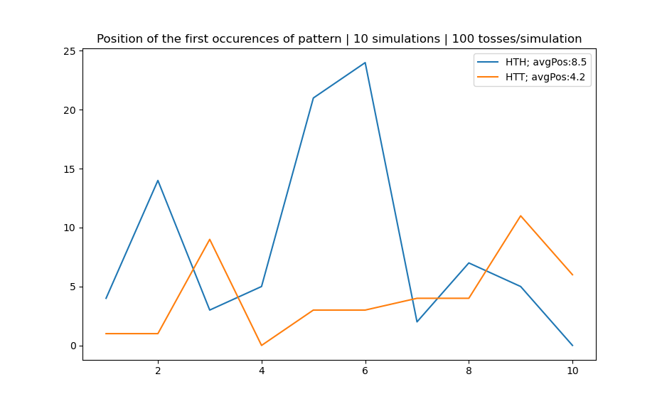
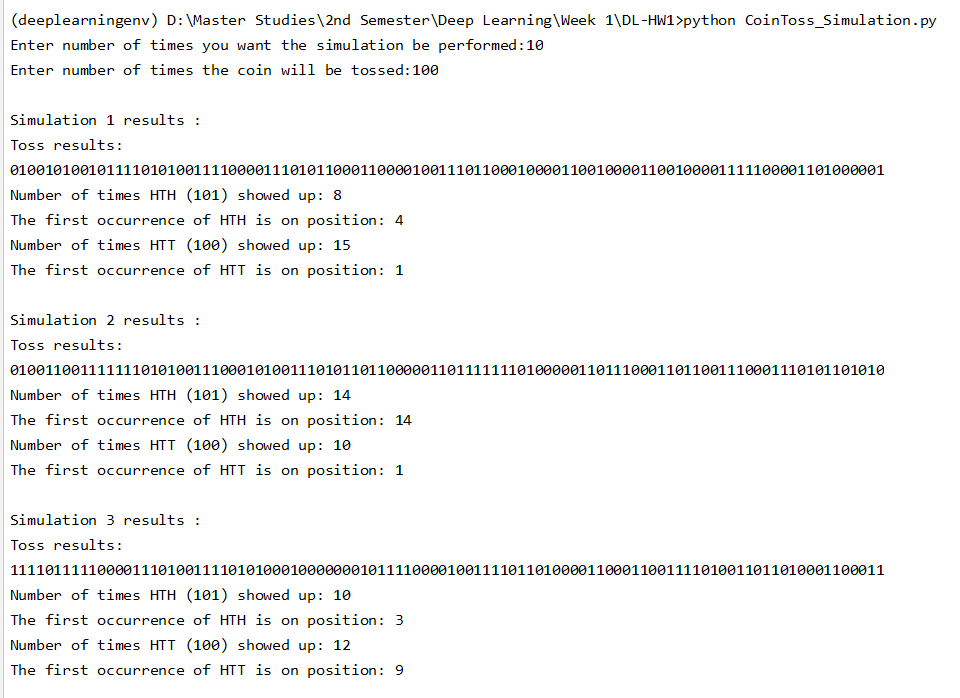

# Deep Learning - Coin Toss Simulation
## Deep Learning Homework 1 No. 9 | Indra Imanuel Gunawan - 20195118

This is my solution for homework 1 no. 9 of the Deep Learning class. The problem is about occurrences of "HTH" and "HTT" pattern in a series of Coin Toss, which was presented by Peter Donnelly at at 2005 TED Talk. In that presentation he said that the average number of "HTT" pattern showing up first is higher than the "HTH" pattern. The goal of this code is to simulate and prove that statement by showing the number of occurrences for both "HTH" and "HTT" and the average of the first occurrences of both patterns in a series of coin toss. The code is implemented using python.

## Setup
Install Numpy & Matplotlib\
`pip install numpy`\
`pip install matplotlib`

## Run
To run the code, just type this on the terminal (make sure that the directory & environment is correct)\
`python DeepLearning_CoinTossSimulation.py`

## Results
Here are the results of the experiment. I did 10 times simulation, with 100 coin toss in each simulation, totalling in 1000 coin tosses.

### Number of Occurrences
As we can see from the figure below, the number of occurrences for "HTT" pattern is higher (130), than that of "HTH" pattern (101).

### Average number of coin toss for the pattern to show up for the first time
As we can see from the figure below, the average number of coin toss needed for the "HTT" pattern to show up is lower (4.2), compared to "HTH" pattern (8.5).

### Output on the Terminal
Here are the results on the terminal for the first few simulations:


## Explanation
Based on the result, we can see that the number of "HTT" occurrences is more than "HTH" occurrences. Not only that, but the average number of coin toss needed for "HTT" pattern to show up is lower than "HTH" pattern. According to Peter Donnelly, this can be explained by using this illustration. Consider that there are two groups, one is waiting for the "HTT" pattern, while the other one waits for the "HTH" pattern. Let's say that the first two results of the coin tosses are "HT". In case for the "HTT" group, if the third toss is "T" then their number of occurrences increase by 1, and the "HTH" group has to wait for another "H" to show up. Meanwhile, for the "HTH" group, if the third toss is "H", their number of occurrences increase by 1, but the "HTT" group, rather than waiting for another "H" to show up, they are already 1/3 of the way to complete their pattern. That's why the number of occurrences for the "HTT" pattern is more than the "HTH" pattern.

## Code Explanation
### Function
This is the function that I used to count the number of occurrences for both "HTH" and "HTT" patterns. Basically, it takes the pattern and sequence (series of coin toss) as parameter, and count how many times does the pattern appears in that sequence.
```python
def countPatternInSequence(pattern, sequence):
    count = 0
    for i in range(len(sequence) - len(pattern) + 1):
        if sequence[i:i + len(pattern)] == pattern:
            count += 1
    return count
```

### Simulation
What happens in these codes are basically I simulate the coin toss using a random number. The number can be either 1 or 0. Head (H) is represented by 1, while Tail (T) is represented by 0. I store the results of the coin tosses (the 1s and the 0s) in a string variable, then I use my function that I've made before to count the number of occurrences for both pattern "HTH" and "HTT". I also use python built-in function (.find), to find the first occurrence of the pattern "HTH" and "HTT". I also print out the results on the terminal here.
```python
numOfSimulation = input("Enter number of times you want the simulation be performed:")
numOfToss = input("Enter number of times the coin will be tossed:")
numHTHs = []
numHTTs = []
firstOccurrencePosHTHs = []
firstOccurrencePosHTTs = []

for j in range(int(numOfSimulation)):
    tossResults = ""
    for i in range(int(numOfToss)):
        #1: Head, 0: Tail
        tossResult = np.random.randint(0,2)
        tossResults += str(tossResult)
        
    print("")
    print("Simulation " + str(j+1) + " results :")
    print("Toss results:")
    print(tossResults)
    
    #HTH (101)
    numHTH = countPatternInSequence("101",tossResults)
    numHTHs.append(numHTH)
    print("Number of times HTH (101) showed up: " + str(numHTH))
    firstOccurrencePosHTH = tossResults.find("101")
    firstOccurrencePosHTHs.append(firstOccurrencePosHTH)
    print("The first occurrence of HTH is on position: "+str(firstOccurrencePosHTH))

    #HTT (100)
    numHTT = countPatternInSequence("100",tossResults)
    numHTTs.append(numHTT)
    print("Number of times HTT (100) showed up: " + str(numHTT))
    firstOccurrencePosHTT = tossResults.find("100")
    firstOccurrencePosHTTs.append(firstOccurrencePosHTT)
    print("The first occurrence of HTT is on position: " + str(firstOccurrencePosHTT))
```

### Plotting it to a graph
These are the codes used to plot the data to the figures. There are 2 figures, one to show the number of occurrences, and the other one to show the number of coin tosses needed for the pattern to show up.
```python
totalOccurrenceHTH = np.sum(numHTHs)
totalOccurrenceHTT = np.sum(numHTTs)
x = np.arange(1,int(numOfSimulation)+1)
plt.plot(x, numHTHs, label="HTH; totalOccurences:"+str(totalOccurrenceHTH))
plt.plot(x, numHTTs, label="HTT; totalOccurences:"+str(totalOccurrenceHTT))
plt.xlabel = "Number of simulations"
plt.ylabel = "Number of occurences"
plt.title("Number of occurrences | " + numOfSimulation + " simulations | " + numOfToss + " tosses/simulation")
plt.legend()
plt.show()

avgPosHTH = np.mean(firstOccurrencePosHTHs)
avgPosHTT = np.mean(firstOccurrencePosHTTs)
plt.plot(x, firstOccurrencePosHTHs, label="HTH; avgPos:"+str(avgPosHTH))
plt.plot(x, firstOccurrencePosHTTs, label="HTT; avgPos:"+str(avgPosHTT))
plt.xlabel = "Number of simulations"
plt.ylabel = "First occurence of pattern"
plt.title("Position of the first occurences of pattern | " + numOfSimulation + " simulations | " + numOfToss + " tosses/simulation")
plt.legend()
plt.show()
```


